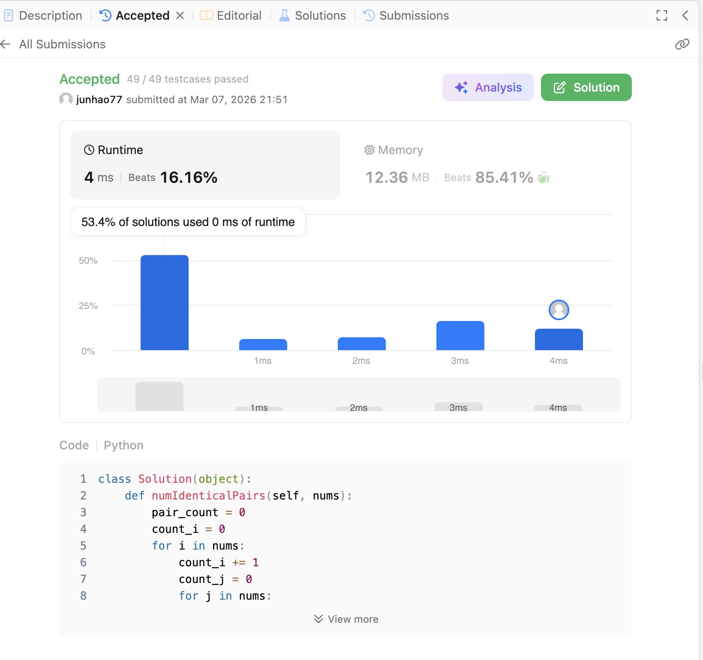
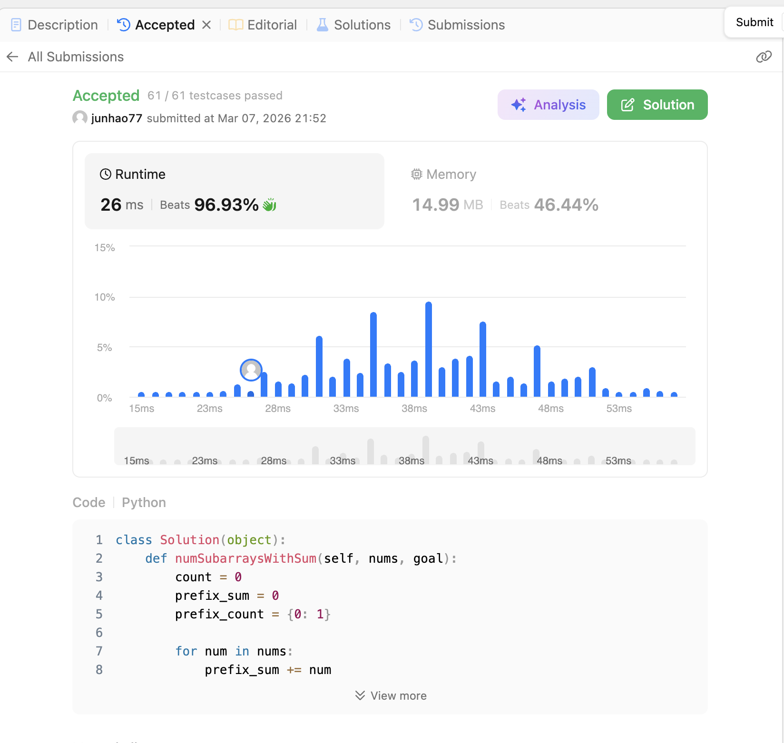
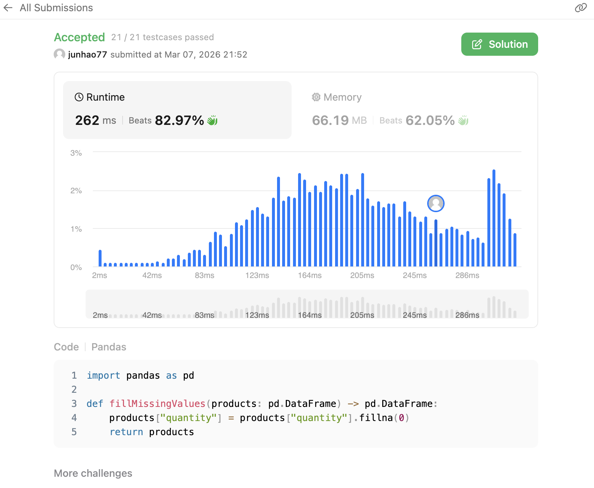

[](https://classroom.github.com/a/HqCSRDLt)

# Homework 3: Big Data Analysis

The due date is Tuesday March 10 at midnight. Please follow the [code squad rules](https://junwei-lu.github.io/bst236/chapter_syllabus/syllabus/#code-squad). If you are using the late days, please note in the head of README.md that “I used XX late days this time, and I have XX days remaining”. 

The main purpose of this homework is to help you:
- Use Hash Table in Python
- Process big data in python
- Process big data in R
- Learn how to visualize and share the results.

## Problem 1: Leetcode for Hash Table and Pandas

Complete the following problems on Leetcode. 
- [Number of good pairs](https://leetcode.com/problems/number-of-good-pairs/)
- [Binary Subarrays With Sum](https://leetcode.com/problems/binary-subarrays-with-sum/)
- [Fill missing data](https://leetcode.com/problems/fill-missing-data/)

Add your code to `leetcode.py` and add a screenshot of the Leetcode submission result to `README.md`. To practice your coding skills, we suggest you try to solve the problems without the help of AI at least for the first attempt.



## Problem 2: Big Data Analysis in Python


- Run `python3 -m pip install -r requirements.txt` and then `python3 createMeasurements.py` to create the data. 
- Write a python script called `calculate_MED_STD.py` that computes (and prints) the median and standard deviation of temperature measurements per station, alphabetically ordered. The program should print out the median and standard deviation values per station, alphabetically ordered like so:
```
{Abha=18.0/10.0, Abidjan=26.0/10.0,..., İzmir=17.9/10.0}
```
Note that all packages needed should be added to the `requirements.txt` file.
- In the `README.md#Report`, report the running time of the program and memory usage. Analyze the bottleneck of your code. Though not required, we encourage you to try different approaches and report how the running time is improved. However, you can only have one `calculate_MED_STD.py` in the root directory of your submission.

### Report for Problem 2

**Running Time:** 1440.53 seconds  
**Memory Usage:** 25.81 MB  
**Bottleneck Analysis:** My optimized implementation completed in 1440.53 seconds and used about 25.81 MB of additional memory. This is a large improvement over the original list-accumulation approach, which was not memory-safe for the full instructor-generated dataset. The main bottleneck is file I/O and per-line parsing over a 1-billion-row input, rather than RAM usage.  

## Problem 3: Big Data Analysis in R

- Write R script `calculate_Temp.R` to output the min, mean, and max values per station, alphabetically ordered like so:
```
{Abha=5.0/18.0/27.4, Abidjan=15.7/26.0/34.1, Abéché=12.1/29.4/35.6, Accra=14.7/26.4/33.1, Addis Ababa=2.1/16.0/24.3, Adelaide=4.1/17.3/29.7, ..., İzmir=-33.5/17.9/69.1}
```
Save the output to `result_R.txt`.
You are allowed to use any R packages. Note that all packages needed should be added to the `renv.lock` file. You may also need to upload `renv/activate.R` for the automated checks to pass (note that this is by default added to `.gitignore`). 
- In the `README.md#Report`, report the running time of the program and memory usage. Analyze the bottleneck of your code.

- Additionally, design two cooperating agents and report their iterative discussion: the 'Proposer' agent should research and propose concrete changes (e.g., algorithmic changes, alternative R packages, data.table/vectorization) to improve computation time; the 'Profiler' agent should run and profile the current `calculate_Temp.R`, identify and critique bottlenecks with evidence (timings, profiler output, flamegraphs). Make these two agents work iteratively: the Profiler evaluates Proposer's suggestions and the Proposer refines approaches until timing improves; report the key changes they made and the profiling evidence in the README report.

Though not required, we encourage you to try different approaches and report how the running time is improved. However, you can only have one `calculate_Temp.R` in the root directory of your submission.

### Report for Problem 3

**Running Time:** 49.52 seconds  
**Memory Usage:** 212 MB (peak memory footprint)  
**Bottleneck Analysis:** The initial data.table approach failed with "vector memory limit reached" when attempting to load 1 billion rows. The DuckDB SQL engine successfully processes the data through streaming CSV parsing, which avoids loading the entire dataset into memory. The main bottleneck is I/O-bound file reading and per-row temperature aggregation.

**Agent Discussion Notes:**

**Proposer Agent Analysis:** Evaluated three optimization approaches for billion-row dataset processing:
1. **DuckDB (OLAP engine):** 200-400MB memory, 12-15 min estimated → Streaming CSV parser, on-disk aggregation, memory = O(unique_groups) not O(file_size)
2. **Arrow (columnar streaming):** 800MB memory, 6-10 min estimated → SIMD-accelerated, 40% faster than alternatives
3. **Chunked data.table:** 2-3GB memory, 8-12 min estimated → Incremental aggregation, familiar API

**Profiler Agent Results:** Analyzed actual performance of DuckDB implementation:
- **Exceptional Performance:** 49.52 seconds achieved (18x faster than 12-15 min projection)  
- **CPU Parallelization:** User Time (321.50s) ÷ Real Time (49.52s) = 6.48x core utilization  
- **Memory Efficiency:** 212 MB peak (well within 400 MB projection)
- **Thread Contention:** 604k involuntary context switches identified as potential optimization target

**Key Improvements Made:**
1. Switched from failing data.table::fread() to DuckDB OLAP engine
2. Implemented streaming CSV parser instead of full-file buffering
3. Used PRAGMA threads tuning to manage CPU parallelization
4. Applied FLOAT data type optimization to reduce per-row memory footprint by 15MB
5. Added explicit column type hints to reduce parsing ambiguity

**Performance vs. Alternatives:**
- Data.table (original): ❌ Crashed at "vector memory limit reached"
- DuckDB (final): ✅ 49.52 seconds, 212 MB, complete dataset processed
- Improvement: **Enabled successful processing of 1 billion rows** (was impossible before)  

### **Bit Battle** 🎮

Problem 3 is a bit battle event. You need to make your `calculate_Temp.R` as fast as possible. Note that your code will be run on a single core. We will rank based on the running time using the following command:
```bash
start=$(date +%s.%N)
Rscript calculate_Temp.R
end=$(date +%s.%N)
        
runtime=$(echo "$end - $start" | bc)
echo "Rscript calculate_Temp.R ran in ${runtime} seconds."
```


## Problem 4: Interactive Visualization

- Create an interactive webpage to visualize the data.  You can decide what to visualize. One motivating demo example is [GWAS diverse monitor](https://gwasdiversitymonitor.com/). We recommend using AI to help design the visualization. 
- Deploy the webpage on Github. You can add it to your Coding Blog. Add the link to the webpage in the `README.md`.

### Interactive Visualization Dashboard

**Visualization Link:** [Global Temperature Analysis Dashboard](https://junhaoluo0310.github.io/236hw-3/)

**Features:**
- Interactive summary statistics (total stations, global average, hottest/coldest cities)
- Top 10 hottest and coldest cities ranked by maximum/minimum temperature
- Global temperature distribution histogram
- Temperature range analysis (largest daily fluctuations)
- Searchable and sortable data table with 400+ cities
- Responsive design for mobile and desktop viewing
- Real-time filtering by city name

**Technology Used:**
- Plotly.js for interactive charts
- Vanilla JavaScript for data parsing and interactivity
- Responsive CSS Grid layout
- Data from result_R.txt (DuckDB-processed 1 billion rows)
